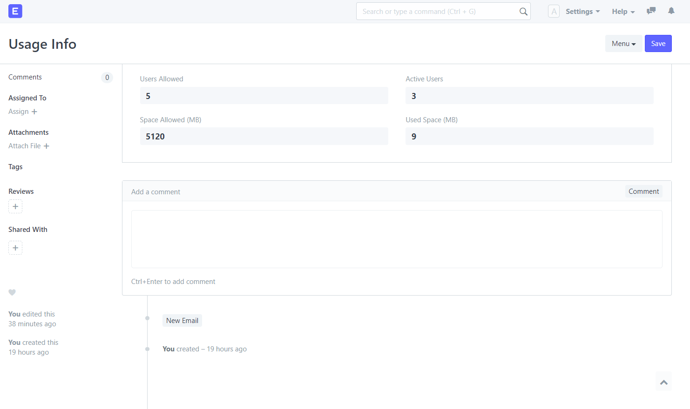
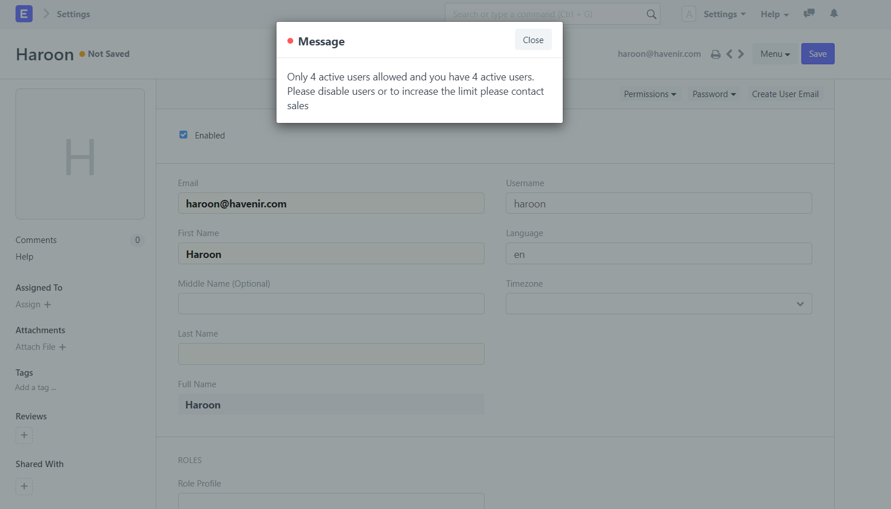

## Erpnext Quota

App to manage ERPNext User, Company and Space limitations
##### Note: Space size does not include database size.

#### How to Install
bench get-app --branch master erpnext_quota https://github.com/MohammadAhmad1990/erpnext_quota
bench include-app erpnext_quota
bench --site *site_name* install-app erpnext_quota

### Usage
Install the app. It will create a file quota.json in site directory
Contents will look like:
{"users": 5, "space": 5120, "company": 2}

Manually change the value of users and space to change the limitations. Default is 5 active users, 2 companies and 5GB space for attachments and backup

After installation and creating new users and company, the file quota.json will get update and look like:
{"users": 5, "space": 5120, "used_space": 9, "active_users": 3, "company": 2, "used_company": 2}}

To see the Usage info with the portal visit the page 'Usage Info'

#### License
MIT