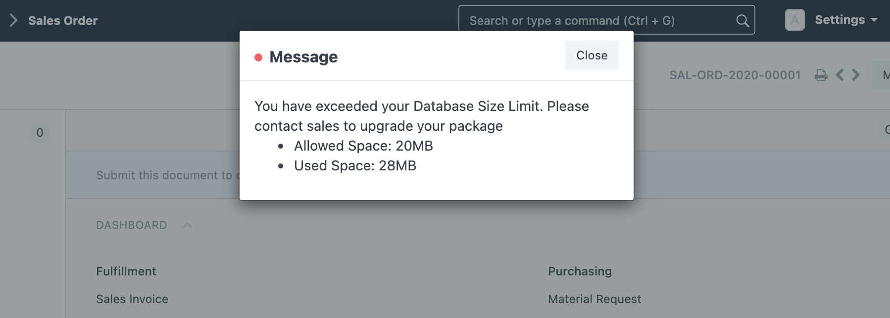
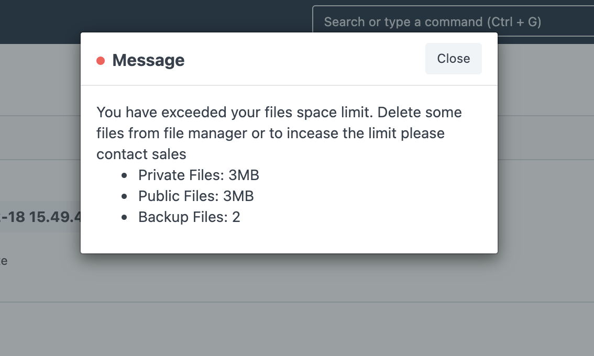
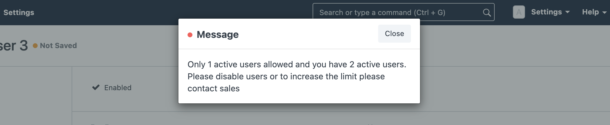
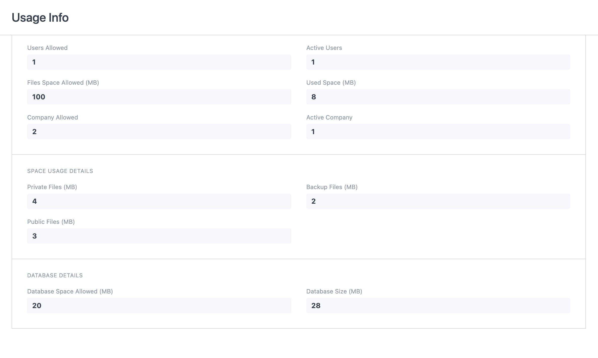

## Erpnext Quota

App to manage ERPNext User, Company and Space limitations

#### How to Install
bench get-app --branch master erpnext_quota https://github.com/ahmadpak/erpnext_quota
bench include-app erpnext_quota
bench --site *site_name* install-app erpnext_quota

### Usage
Install the app. It will create a file quota.json in site directory
Contents will look similar:

{
  "users": 5,
  "active_users": 1,
  "space": 5120,
  "db_space": 100,
  "company": 2,
  "count_website_users": 0,
  "count_administrator_user": 0,
  "valid_till": "2021-01-03",
  "used_company": 1,
  "used_space": 8,
  "private_files_size": 4,
  "public_files_size": 3,
  "backup_files_size": 2,
  "used_db_space": 28
}

Manually change the default values to change the limits. 
Default is:
- 5 active users not including website users
- 2 companies
- 5GB space for attachments and backup
- 100MB space for Database

quota.json file will automatically get updated for any 

To view the Usage info, find it in Settings Module or search 'Usage Info' in the awesome bar

#### License
MIT
